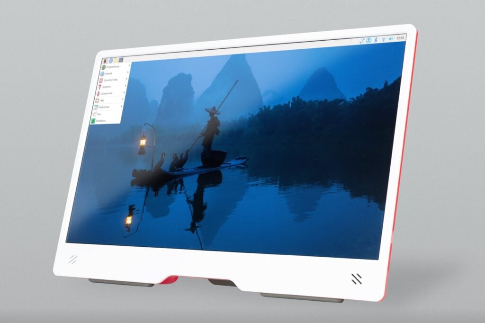

# An Eco-Friendly and Accessible Mobile Classroom

Digital education is now a key lever for personal and professional development. It is therefore crucial to offer innovative, accessible, and environmentally friendly solutions. In this context, I envisioned a mobile classroom based exclusively on the use of Raspberry Pi. This solution addresses training needs for both client stations and server management, while offering low energy consumption and high modularity.

Traditional computers, while effective, are often energy-intensive and costly, limiting their use in contexts where resources are limited. Moreover, these devices are frequently oversized compared to actual needs in a learning environment. In contrast, a Raspberry Pi 500, which combines a computer and keyboard in a compact format, consumes an average of 2 watts at rest and 9 watts under full load, compared to 60 to 200 watts for a laptop or desktop tower (excluding the screen). This low consumption translates into significant energy savings and a much-reduced ecological footprint.

## Key Advantages of the Concept
- **Low energy consumption:** A fleet of 6 Raspberry Pi devices consumes barely as much as a single traditional computer (excluding screens in both cases), enabling educational infrastructures to be deployed using limited energy sources.
- **Portability:** Thanks to their small size and light weight, Raspberry Pi devices can be integrated into a mobile case for easy deployment during lab sessions.
- **Affordable cost:** Each unit is far less expensive than a traditional computer, making this solution accessible to organizations with tight budgets. The cost is approximately €250 per machine (Raspberry Pi 500 + monitor).
- **Technological flexibility:** Raspberry Pi devices can be configured to run a wide variety of applications, including educational platforms, web servers, programming environments, and even home automation or robotics through GPIO.

With this approach, we propose an economical, ecological, and efficient alternative to democratize access to IT training while respecting current challenges of sustainability and innovation.

---

## 1. Objectives of the Proof of Concept (POC)
- **Demonstrate technical feasibility:** Verify whether Raspberry Pi devices can function as both servers and clients in a "sandbox" lab environment.
- **Test user experience:** Ensure the configuration is intuitive and functional in an educational setting.
- **Define hardware and software requirements:** Identify the components needed to build the complete solution.

---

## 2. Architecture of the Mobile Classroom

### Hardware Components
1. **Raspberry Pi for clients:**
   - Model: Raspberry Pi 500 with 8 GB of RAM.
   - Accessories: MicroSD cards (32 GB), power supply, etc. All included in the Raspberry Pi 500 pack.
2. **[Raspberry Pi for servers:](installserver.md)**
   - Model: Raspberry Pi 500 with 8 GB of RAM.
   - External USB hard drive for data storage (for a local server).
3. **Network Infrastructure:**
   - Portable Wi-Fi router or access point.
   - Ethernet cables.
4. **Power Supply:**
   - Extension cord and power strip.
5. **Transport Case:**
   - A sturdy case with compartments to carry all the equipment.

---

### Software Components
1. **Operating Systems:**
   - Raspberry Pi OS for clients.
   - Raspberry Pi OS Lite or Ubuntu Server for the server.
2. **Server Software:**
   - Web server: Nginx or Apache to host mobile classroom documentation.
   - File server: NFS or Samba.
   - Authentication: LDAP.
   - Future needs: Docker.
3. **Client Software:**
   - Web browser (e.g., Chromium).
   - Programming environments: Python, Node.js, lightweight IDEs like Thonny or Visual Studio Code, Docker.
4. **Network Management Tools:**
   - Wireshark.
5. **Security Configuration:**
   - SSH enabled for remote management.
   - Firewalls and network rules to secure the environment.

---

## 3. Development of the POC

1. **Hardware Setup:**
   - Prepare a Raspberry Pi server with essential services.
   - Prepare several Raspberry Pi clients with a minimal environment.
2. **Software Installation:**
   - Configure the server to host an application or educational content (e.g., documentation, authentication, file sharing).
   - Configure the clients to access server services via the local network.
3. **Testing:**
   - Check the stability of the connection between clients and the server.
   - Test various usage scenarios (simultaneous access, latency, etc.).
   - Measure power consumption.
4. **Functional Demonstration:**
   - Simulate a training session with multiple connected clients.

---

## 4. Evaluation and Documentation
- Write a report on the experience, including:
  - Challenges encountered (hardware and software).
  - Observed performance (stability, speed, etc.).
  - Possible improvements.
- Produce simple documentation to enable replication of the setup.

---

## 5. Preliminary Budget
- **Raspberry Pi (clients + servers):** €150 per unit.
- **Accessories (power strips + monitors):** €120 per client kit.
- **Network infrastructure:** €0 (recovered).
- **Transport:** €100.
- **Total estimated cost for a basic POC setup:** 5 clients + 1 server, i.e., €1,500.

---

  
[Learn more about Raspberry Pi 500](https://www.raspberrypi.com/products/raspberry-pi-500/)

  
[Learn more about Raspberry Pi Monitor](https://www.raspberrypi.com/products/raspberry-pi-monitor/)
